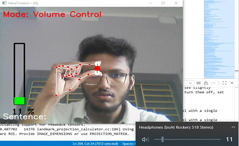
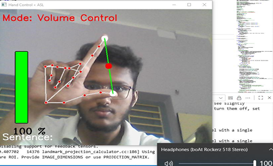
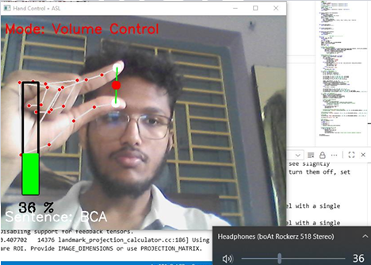
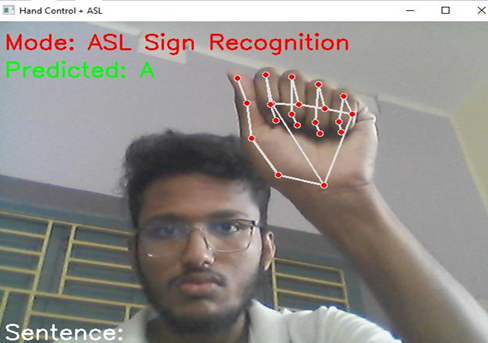
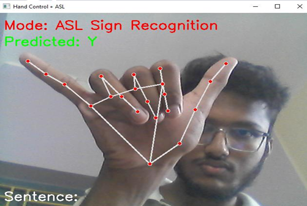
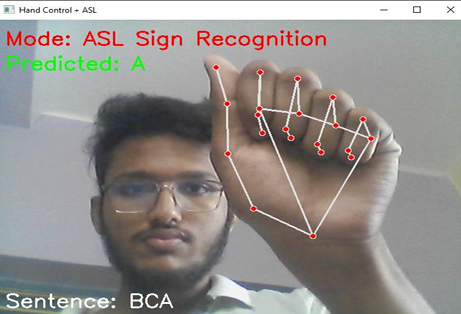

ASL Hand Gesture Recognition & Volume Controller 👐🔊

A real-time dual-mode hand gesture recognition system that combines American Sign Language (ASL) letter recognition with volume control using computer vision and machine learning.

✨ Features

    1.Dual Mode Operation:

        a.Volume Control Mode: Pinch gesture controls system volume with smooth interpolation

        b. ASL Recognition Mode: Real-time A-Z letter recognition using ML classifier

    2.Gesture-Based Mode Switching: Fist → Open hand gesture toggles modes

    3.Sentence Building: Confirmed ASL letters build readable sentences

    4.Visual Feedback: Real-time hand landmarks, volume bar, predictions, and mode display

    5.Keyboard Controls: Quick sentence clear (c), delete (d), confirm (k), quit (q)

🎥 Demo

text
Volume Control: Thumb-Index distance → Volume level
ASL Recognition: Hold letter pose → Predict → Press 'k' to confirm
Mode Switch: Close fist → Open hand (0.8s cooldown)

🛠️ Tech Stack
| Component          | Technology                                |
| ------------------ | ----------------------------------------- |
| Computer Vision    | OpenCV, MediaPipe Hands                   |
| Machine Learning   | scikit-learn RandomForest                 |
| Audio Control      | pycaw (Windows)                           |
| Feature Extraction | 21 hand landmarks + 5 fingertip distances |

📦 Installation
Clone repository
git clone https://github.com/yourusername/asl-hand-gesture-recognition.git
cd asl-hand-gesture-recognition

Create virtual environment
python -m venv venv
source venv/bin/activate  # Linux/Mac

venv\Scripts\activate  # Windows

Install dependencies
pip install opencv-python mediapipe scikit-learn numpy pycaw comtypes

🗂️ Project Structure

text

asl-hand-gesture-recognition/
├── asl_real_time_recognition.py     # Real-time detection & control
├── train_model.py          # Train ASL classifier
├── asl_classifier_optimized.pkl  # Trained model
├── asl_dataset/            # Training images (A-Z folders)
└── README.md

🚀 Quick Start

    Train the model (first time only):
bash
python train_model.py

    Run the application:

bash
python main.py

    Controls:

        q: Quit

        c: Clear sentence

        d: Delete last letter

        k: Confirm ASL prediction (ASL mode only)

🎮 How It Works
Mode 0: Volume Control

text
Thumb ↔ Index finger distance
     ↓
Interpolated [20px → 180px] → [0% → 100% volume]
     ↓
Smooth volume transitions with threshold

Mode 1: ASL Recognition

text
Hand landmarks (21×3) + 5 fingertip distances
     ↓
RandomForestClassifier (200 trees)
     ↓
Stable prediction (0.5s) → Press 'k' → Add to sentence

Mode Switching

text
Fist closed → Open hand (after 0.8s cooldown)
     ↓
Toggle between Volume Control ↔ ASL Recognition

🤝 Usage Modes
| Mode   | Gesture           | Action                  |
| ------ | ----------------- | ----------------------- |
| Volume | Thumb-Index pinch | Adjust volume (0-100%)  |
| Volume | Open hand         | Show current volume bar |
| ASL    | Hold letter pose  | Predict letter (A-Z)    |
| Switch | Fist → Open       | Toggle modes            |

📊 Model Performance

text
Accuracy: ~95% (depends on dataset)
F1 Score: ~94% (macro average)
Classes: A-Z (26 letters)
Features: 69 (landmarks + distances)

🖥️ Screenshots

🔧 Customization

hands = mpHands.Hands(min_detection_confidence=0.7, min_tracking_confidence=0.7)

vol_threshold = 0.02  # Lower = more responsive

prediction_stable_threshold = 0.5  # Seconds

mode_switch_cooldown = 0.8  # Seconds

🐛 Troubleshooting
| Issue              | Solution                                            |
| ------------------ | --------------------------------------------------- |
| No module pycaw    | Windows only. Use pip install pycaw comtypes        |
| Low ASL accuracy   | Retrain with train_model.py + more dataset images   |
| Webcam lag         | Reduce resolution: cap.set(3, 640), cap.set(4, 480) |
| Mode not switching | Check hand detection confidence & cooldown timer    |

📁 Dataset Preparation

    1.Create asl_dataset/A/ through asl_dataset/Z/ folders

    2.Add 50+ images per letter showing clear hand poses

    3.Run python train_model.py to generate classifier

🤝 Contributing

    1.Fork the repository

    2.Create feature branch (git checkout -b feature/amazing-feature)

    3.Commit changes (git commit -m 'Add amazing feature')

    4.Push to branch (git push origin feature/amazing-feature)

    5.Open Pull Request

📄 License

This project is open source and available under the MIT License.
🙏 Acknowledgments

    MediaPipe Hands for robust hand tracking

    OpenCV for computer vision

    scikit-learn for ML classifier

    ASL community for gesture standardization
